# ScenePaste

[](https://github.com/embed9669-alt/ScenePaste/actions/workflows/ci.yml)

**面向计算机视觉的“场景优先”可控合成数据集生成工具。**

ScenePaste 是一个本地运行的桌面软件 + CLI，用真实目标素材和真实背景构建**可控的合成训练数据**。它不是简单地随机贴图，而是把 Copy-Paste 组织成完整的数据生产流程：

**目标素材 → 场景编辑 → 目标外观 → 场景模板 → 批量合成 → 自动标注 → 可视化检查 → 数据 QA → 模型难例回灌 → 数据策展 / 分片**

> **当前版本：v1.1.0 Stable。** 在 v1.0 生产基线之上，增加可审计的目标级外观 Recipe、主界面批量生成默认项，以及选中实例时的实时外观预览。合成数据进入训练前仍建议人工抽检，并用独立真实验证集/测试集验证收益。

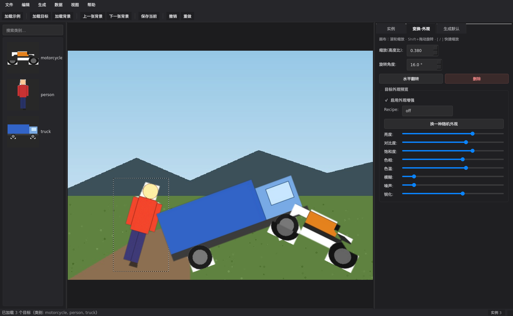

### 整条工作流（动图）

从摆场景到数据闭环，五段短 GIF（可本地重录：`python scripts/capture_workflow_gifs.py`）：

| 步骤 | 做什么 |
|---|---|
| 1. 摆场景 | 放置 cutout，缩放 / 旋转构图 |
| 2. 目标外观 | 选中实例启用 Recipe，调滑条或换种子 |
| 3. 批量默认 | 右侧设场景 Recipe / 目标外观 / Blend / 负样本 |
| 4. Explorer | 浏览生成图与 Detect/Seg/OBB 等叠加 |
| 5. 数据闭环 | 难例 / QA / 对比 / 策展 / 分片入口 |

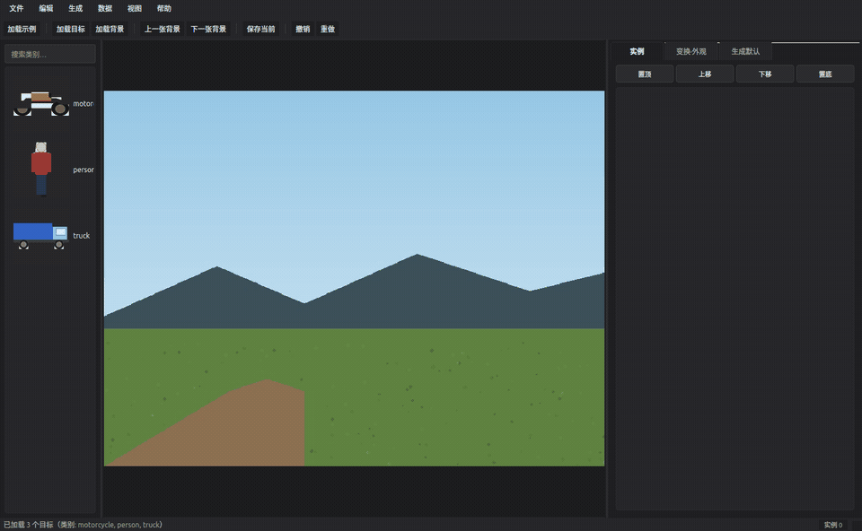

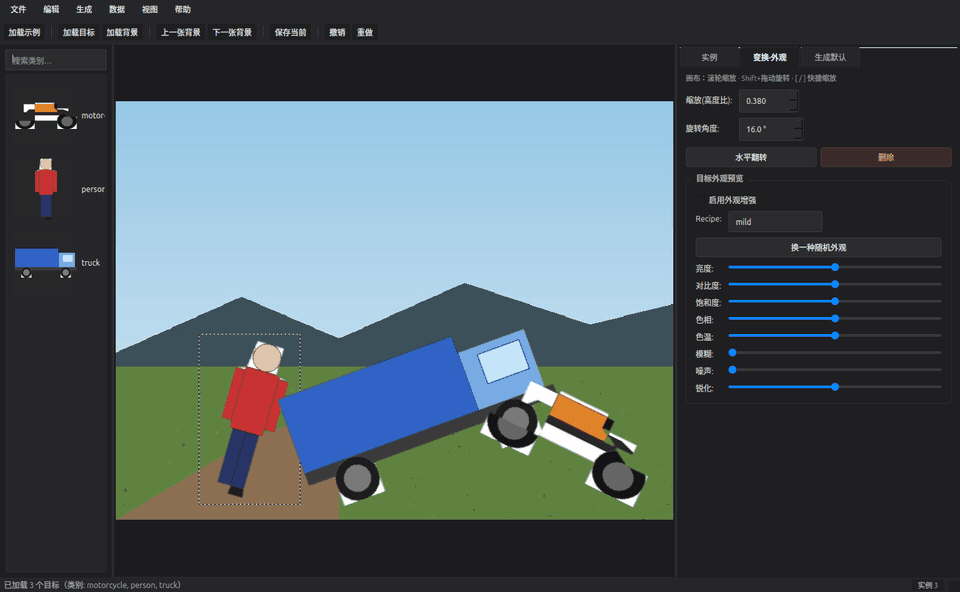

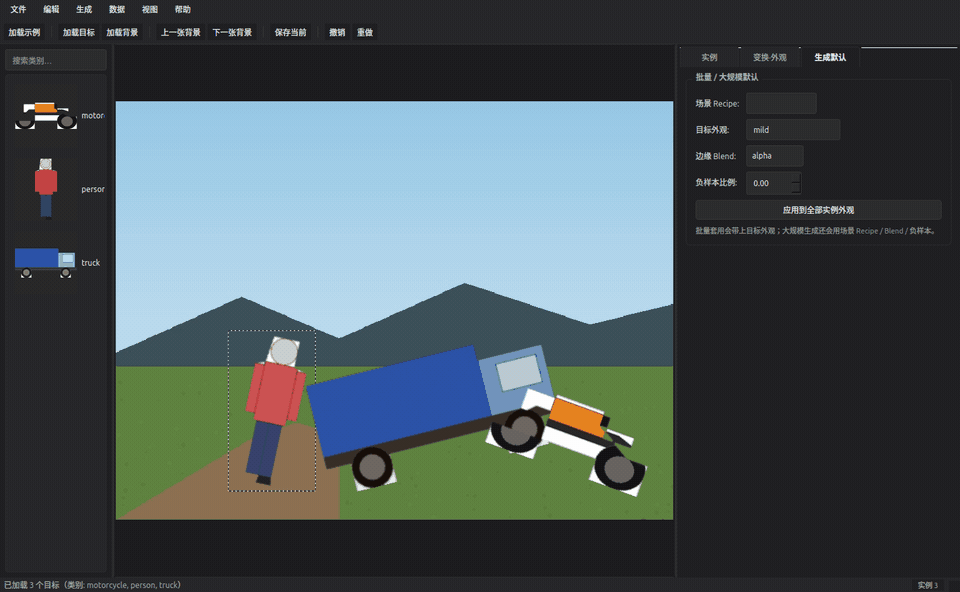

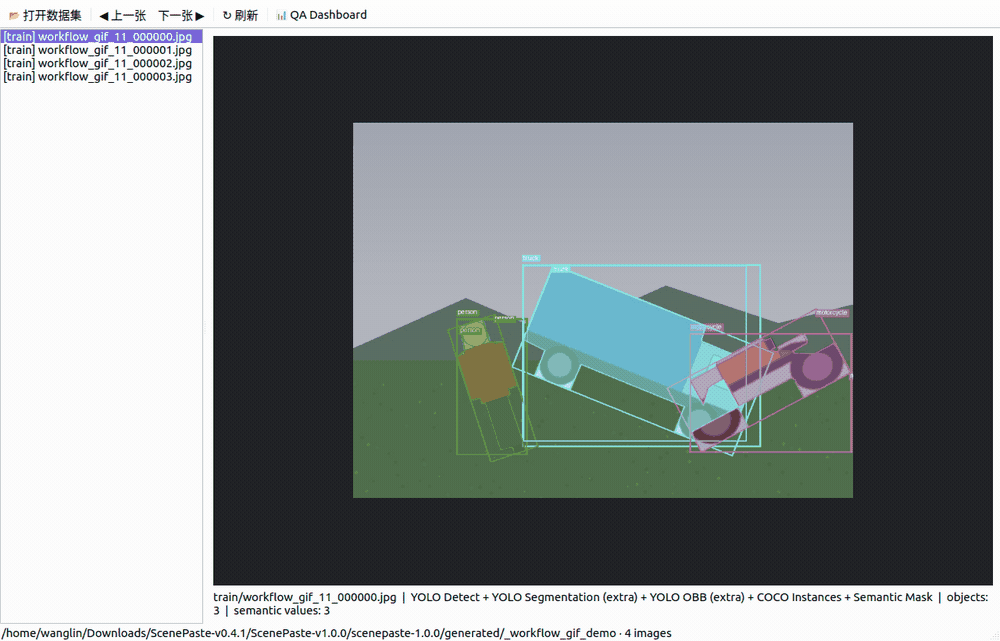

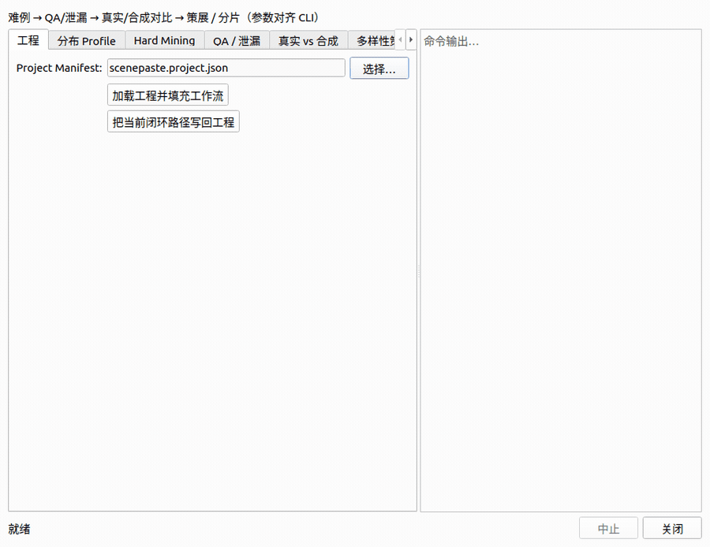

<details>
<summary>浅色主题与项目设置</summary>

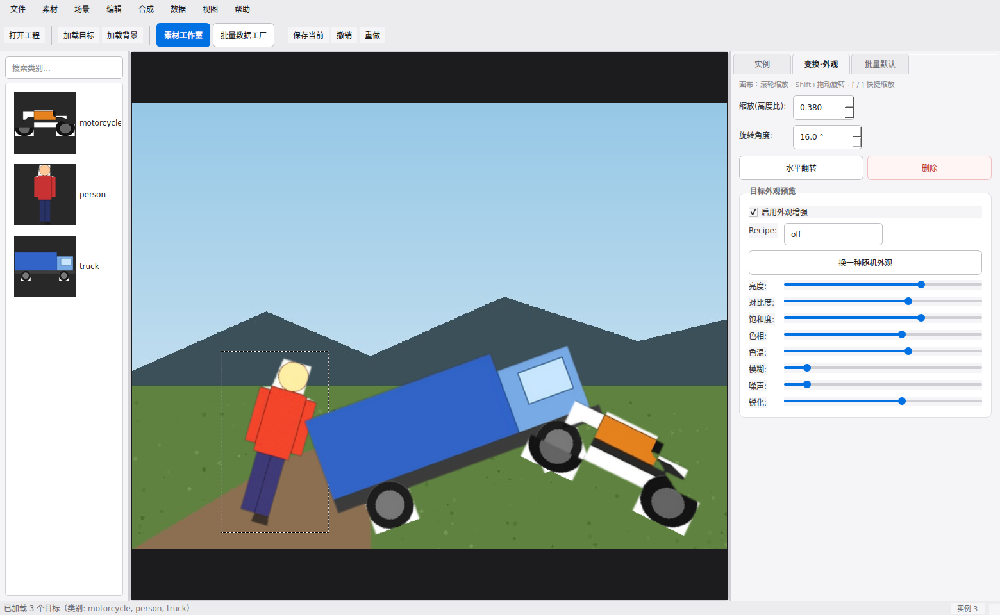

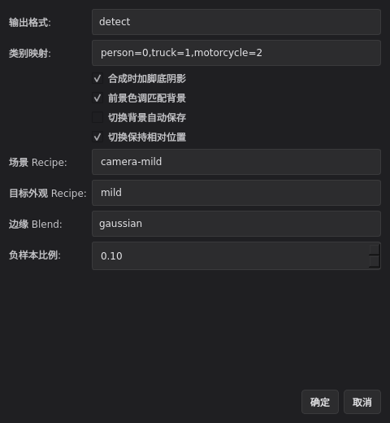

</details>

### 实际生成效果

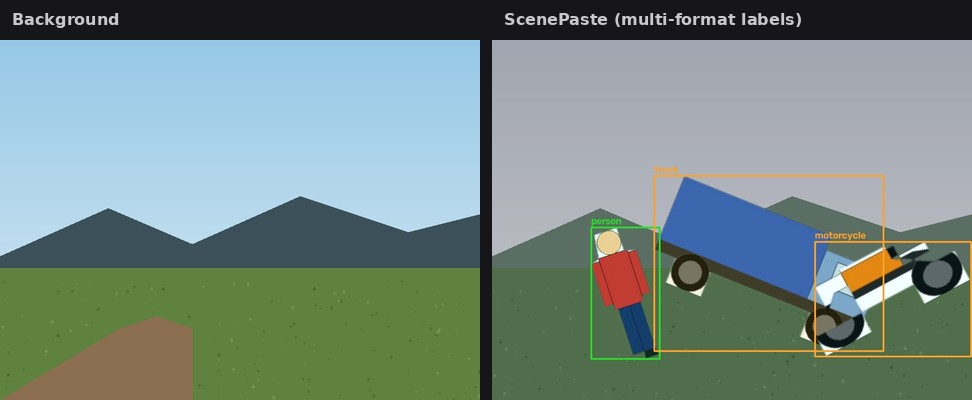

同一次合成可导出多种标注任务（`--output-format all`）：

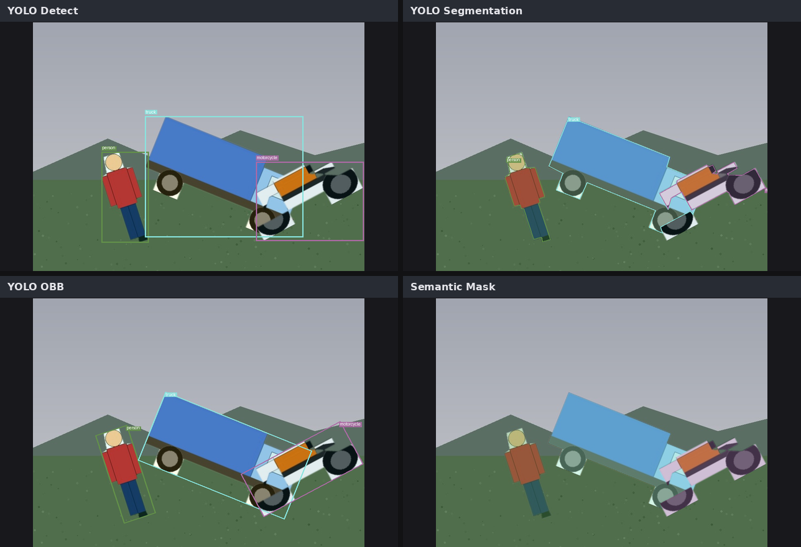

| Detect | Segmentation | OBB | Semantic |
|---|---|---|---|
| 轴对齐检测框 | 实例分割多边形 | 旋转框 | 语义分割像素掩码 |

<details>
<summary>数据集浏览器 · 数据闭环中心 · QA</summary>


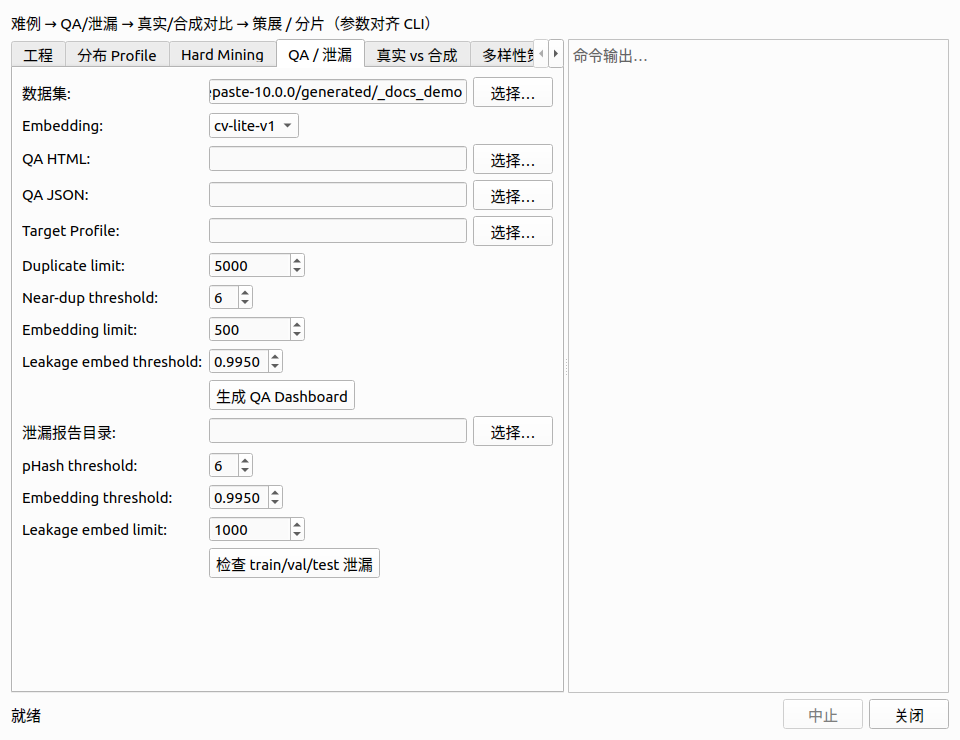

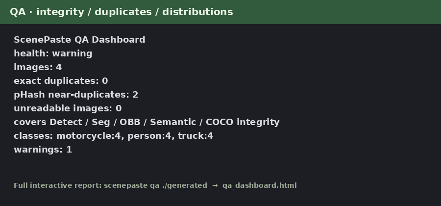

</details>

源码仓库和正式 wheel 都内置一套很小的公开示例数据，无需准备自己的素材就可以直接体验 GUI；源码树还可直接用 `samples/` 跑 CLI 示例。

## ScenePaste 适合解决什么问题？

当普通随机增强不够时，可以用 ScenePaste：

- 有意识地制造稀缺、危险、长尾场景；
- 人工摆好一次合理布局后，保存为**场景模板**并应用到大量背景；
- 控制目标的位置、尺度、透视、旋转、翻转、遮挡和前后层级；
- 从同一个最终场景一致地产生 Detect / Seg / Semantic / OBB / COCO 标注；
- 离线、本地、可重复地批量生成数据；
- 使用内置 **Dataset Explorer** 直接检查生成图及其标签；
- 训练前检查类别均衡、素材复用、背景复用和标签健康度；
- 将 YOLO 推理的漏检、误检、低置信度和定位不准结果回灌为下一轮 Hard Profile；
- 检查 train/val/test 的完全重复、pHash 近重复和轻量 embedding 高相似泄漏；
- 对比真实与合成数据的类别/目标数/位置/尺度/外观域差异；
- 从大数据集中选择更有多样性的代表样本，并按需导出完整标签子集；
- 将百万级目录整理成确定性的 WebDataset tar shards。

ScenePaste **不是新的 Copy-Paste 论文算法**。它的价值是把 Copy-Paste 做成一个真正适合视觉工程项目使用的、可控、可检查、可追溯的数据生产工具。

## 主要功能

- **PySide6 可视化场景编辑器**：拖动、缩放、旋转、翻转和复制目标，并按前后层级正确处理遮挡。
- **主界面批量生成默认**：右侧常驻场景 Recipe / 目标外观 / Blend / 负样本比例；批量套用、大规模生成与工程保存共用。
- **目标外观实时预览**：选中实例后可启用 Recipe，调节亮度/对比度/饱和度/模糊，或「换一种」重采样；只改 RGB，标签几何不变。
- **目标外观 Recipe**：按类别控制贴图光度与低分辨率退化（alpha-aware 边缘），并写入每实例 metadata / QA 覆盖统计。
- **场景增强 Recipe + 融合模式**：整图相机/监控/弱光增强，支持 alpha / hard / gaussian。
- **关系约束 Scene Template v2**：位置/尺度/角度/出现概率/翻转/同类替换，以及 `left_of/right_of/above/below/min_distance/max_distance`。
- **数据集浏览器**：可视化 Detect / Seg / OBB / COCO / Semantic 标注。
- **素材搜索 + 响应式缩略图浏览**。
- **LabelMe / X-AnyLabeling 输入**及 polygon 提取；可选 **rembg 自动抠图**。
- **约束式放置**：通用 / 类别专属 `paste_zone`、透视缩放、模板关系约束。
- **Mask-first 标注链路**：按最终可见区域处理遮挡。
- 支持 **YOLO Detect / Segment / OBB、Semantic Segmentation、COCO Instances**。
- 类别/背景均衡采样，以及可控纯背景负样本。
- **真实数据分布学习生成** + Domain Profile 混合。
- **可恢复多进程生成**、固定种子、Run ID、崩溃安全 metadata。
- **QA Dashboard + 数据策展**：HTML + JSON，检查完整性、完全重复、pHash 感知近重复、cv-lite embedding 多样性、跨 split 泄漏、类别/尺度/位置分布、复用度以及目标分布偏差。
- **Detect / Seg / OBB Hard Example Mining**：读取 YOLO 风格预测 TXT，统计 FN / FP / 低置信 TP / 几何 IoU 不足，导出难例列表与可再次用于生成的 Hard Profile。
- **真实 vs 合成对比 Dashboard**：比较类别、每图目标数、位置、宽高、面积、宽高比和轻量视觉域差异。
- **多样性筛选**：greedy farthest-point 选择代表性样本，可导出完整带标签子数据集。
- **Project Manifest + 数据闭环中心**：用一个 `scenepaste.project.json` 保存工程路径/类别/真实数据/验证集/预测/Profile/Template；GUI 统一执行 Profile、Hard Mining、QA、对比、策展与 Sharding。
- **可选 CLIP / DINOv2 Embedding**：默认仍使用完全离线的 `cv-lite-v1`，需要时再安装 foundation-model embedding。
- **WebDataset Sharding**：固定样本数/字节上限的确定性 tar shard，manifest 带 sample 数、大小和 SHA-256。
- 数据集统计、合并、防泄漏拆分。
- 深色/浅色主题和跨平台 CI。

## 安装

**需要 Python 3.10 及以上**（CI 覆盖 3.10–3.13）。

推荐桌面版：

```bash
cd ScenePaste
python -m pip install -e ".[dev,gui-qt]"
```

若 PyPI / 镜像拉 build 依赖时 SSL 不稳定，可在本机已有 setuptools 时使用：

```bash
python -m pip install --no-build-isolation -e ".[dev,gui-qt]"
```

自动抠图：

```bash
python -m pip install -e ".[auto]"
```

常用桌面功能：

```bash
python -m pip install -e ".[all,dev]"
```

可选 CLIP / DINOv2 Embedding：

```bash
python -m pip install -e ".[embeddings]"
```

只安装核心生成器：

```bash
python -m pip install -e .
```

## 一个命令，十四类工作流

```text
scenepaste gui          # 场景编辑器
scenepaste generate     # 批量生成
scenepaste explore      # 数据集/标注可视化浏览
scenepaste analyze      # 快速数据 QA / 统计
scenepaste qa           # 完整 JSON + HTML QA Dashboard
scenepaste profile      # 学习/查看/混合真实数据分布 Profile
scenepaste recipe       # 查看/导出增强 Recipe
scenepaste split        # 按源目标防泄漏拆分
scenepaste merge        # 合并多个数据集
scenepaste curate       # Hard Mining / 泄漏检查 / 多样性筛选
scenepaste compare      # 真实 vs 合成数据对比 Dashboard
scenepaste shard        # WebDataset-compatible tar 分片
scenepaste project      # 可移植工程 Manifest
scenepaste loop         # 统一“数据闭环中心”GUI
```

```bash
scenepaste --help
scenepaste --version
```

## 30 秒体验 GUI

正式 wheel 已把小型公开示例作为 package resource 一起安装。直接运行：

```bash
scenepaste gui
```

然后点 **★ 加载示例** 即可；普通 pip/wheel 安装后也能使用，不需要依赖源码目录。

### 使用自己的素材时（不用示例）

准备两个目录：

```text
objects/                 # 目标素材
  person_001.jpg
  person_001.json        # LabelMe / X-AnyLabeling 多边形（必需）
  truck_002.jpg
  truck_002.json

backgrounds/
  street_01.jpg
  street_01.json         # 可选：paste_zone / paste_zone:person / ground / road
  street_02.jpg
```

- 目标：同名图片 + LabelMe JSON（JSON 里画目标 polygon，`label` 即类别名）。
- 背景：可以只有图片；需要限制落脚区域时再加同名 JSON。
- 类别 ID 用 `--class-map` / 项目设置声明一次（GUI 加载时会自动补齐未知类别）。

如果你是在完整源码仓库中运行，也可以直接使用根目录 `samples/` 做 CLI 测试：

```bash
scenepaste generate \
  --objects ./samples/objects \
  --backgrounds ./samples/backgrounds \
  --output ./generated \
  --count 20 \
  --class-map "person=0,truck=1,motorcycle=2"
```

源码树 `samples/templates/` 中附带参数化和关系约束场景模板。详见 [docs/SCENE_TEMPLATES.md](docs/SCENE_TEMPLATES.md)。

## Project Manifest 与数据闭环中心

推荐把一个视觉项目的路径和默认配置保存为：

```bash
scenepaste project init . \
  --objects ./objects --backgrounds ./backgrounds --output ./generated \
  --class-map "person=0,truck=1"

scenepaste generate --project ./scenepaste.project.json --count 100000 --workers 8
```

主 GUI 可以直接“📁 打开工程 / 💼 保存工程”。点击 **🧠 数据闭环**，或者运行：

```bash
scenepaste loop --project ./scenepaste.project.json
```

即可统一完成 Profile 学习、Detect/Seg/OBB Hard Mining、QA/泄漏、真实合成对比、多样性策展和 WebDataset Sharding。详见 [工程 Manifest](docs/PROJECTS.md) 与 [数据闭环中心](docs/DATA_LOOP_CENTER.md)。

## 批量生成

```bash
scenepaste generate \
  --objects ./samples/objects \
  --backgrounds ./samples/backgrounds \
  --output ./generated \
  --count 1000 \
  --min-objects 1 \
  --max-objects 3 \
  --class-map "person=0,truck=1,motorcycle=2" \
  --output-format detect \
  --asset-sampling balanced \
  --background-sampling balanced \
  --preview-ratio 0.01 \
  --background-cache-size 16
```

### 从真实数据学习生成分布

```bash
scenepaste profile learn ./real_dataset --geometry-source auto -o distribution_profile.json
```

Profile 会学习类别比例、每图目标数量、位置/尺度、面积/宽高比以及**目标最大重叠 IoU（拥挤/遮挡代理）**；有 polygon/mask 时还学习可见形状占比，支持 **LabelMe、YOLO Detect/Seg/OBB、COCO**。

多个真实 Domain 可以按显式权重混合：

```bash
scenepaste profile mix factory.json tunnel.json -w 0.7 0.3 -o mixed_profile.json
```

每个 Profile 会先归一化，不会因为某个源数据集图片更多就自动支配混合结果。

```bash
scenepaste generate \
  --objects ./objects \
  --backgrounds ./backgrounds \
  --output ./generated \
  --class-map "person=0,truck=1" \
  --count 100000 \
  --distribution-profile distribution_profile.json \
  --profile-strength 1.0 \
  --workers 0 \
  --preview-ratio 0.01
```

### 增强 Recipe、融合方式与负样本

ScenePaste 可以在合成场景完成后执行不改变几何位置的图像级增强，因此检测框、分割、OBB 和 Semantic 标签仍保持对齐。内置 `clean`、`camera-mild`、`surveillance`、`low-light`：

```bash
scenepaste recipe list
scenepaste recipe --kind object list
scenepaste generate ... \
  --output-format all \
  --object-appearance-recipe mild \
  --augmentation-recipe surveillance \
  --blend-mode gaussian \
  --empty-scene-prob 0.10
```

`--object-appearance-recipe` 在粘贴前对**单个贴图**做亮度/对比度、色相/饱和度、Gamma、色温、模糊/噪声、JPEG、运动模糊、锐度和低分辨率退化。邻域类处理采用 alpha-aware 方式，避免把 mask 外原背景卷回目标边缘；自定义 Recipe 会严格校验，实际应用的效果会进入 metadata 与 QA Dashboard。`--augmentation-recipe` 仍作用于整张合成图。`--empty-scene-prob` 可按比例生成纯背景负样本。详见 [目标外观 Recipe](docs/OBJECT_APPEARANCE.md) 与 [场景增强 Recipe](docs/AUGMENTATION_RECIPES.md)。

### 可恢复多进程大规模生成

```text
--workers 0                  自动使用约 CPU-1 个进程
--workers 8                  指定 8 个进程
--queue-depth 0              在途任务受限，默认 workers*2
--run-id my_experiment       固定 Run ID
--resume                     只补未完成 index
--preview-ratio 0.01         只保存少量质检预览
--background-cache-size 16   每个 worker 的背景 LRU
--seed 42                    每个 index 确定性规划
```

状态保存在 `.scenepaste/runs/<run_id>.sqlite3`。中断后使用相同参数加 `--resume` 即可继续，恢复前会校验配置 hash。

### 参数化 Scene Template

Scene Template v2 支持 X/Y 范围、尺度范围、角度范围、实例出现概率、翻转概率、同类别随机换素材、保留遮挡以及 `left_of/right_of/above/below/min_distance/max_distance` 关系约束。GUI 点击 **📝 存模板**即可配置；也可直接使用 `samples/templates/parameterized_mixed_traffic.json` 或 `constrained_person_truck.json`。

## 输出格式

| 模式 | 输出 | 用途 |
|---|---|---|
| `detect` | `labels/train/*.txt` | Ultralytics YOLO Detect |
| `seg` | `labels-seg/train/*.txt` | Ultralytics YOLO Segment |
| `both` | Detect 在 `labels/train`，Seg 在 `labels-seg/train` | 双格式输出 |
| `obb` | `labels-obb/train/*.txt` | Ultralytics YOLO OBB 四角点格式 |
| `semantic` | `masks/train/*.png` + `semantic_classes.json` | 语义分割 |
| `coco` | `instances_coco.json` + Detect 标签 | COCO 实例分割 |
| `all` | Detect + Seg + OBB + Semantic + COCO | 单次渲染多任务导出 |

Semantic mask 固定保留 `0` 为背景，数据集 class `0` 写为 mask value `1`，依次类推。详见 [docs/FORMATS.md](docs/FORMATS.md)。

重新生成上文多格式拼图与 Explorer / QA 截图：

```bash
python scripts/capture_docs_screenshots.py
```

## 用模型难例闭环下一轮生成

对于 YOLO Detect / Seg / OBB，可以保存对应预测 TXT（每行 `class xc yc w h confidence`），然后交给 ScenePaste：

```bash
scenepaste curate hardmine ./real_yolo_dataset \
  --predictions ./runs/detect/predict/labels \
  --task detect --split val \
  --top 500 \
  -o ./hardmine
```

ScenePaste 会按 FN、FP、低置信度真阳性和定位 IoU 不足为图片打难度分，并输出：

```text
hard_examples.json / .csv / .txt
hardmine_dashboard.html
hard_negative_backgrounds.txt
hard_distribution_profile.json
```

然后可直接把难例 Profile 回灌：

```bash
scenepaste generate ... \
  --distribution-profile ./hardmine/hard_distribution_profile.json \
  --profile-strength 0.8
```

详见 [模型难例闭环](docs/HARD_EXAMPLE_MINING.md)。

## 数据策展、跨 split 泄漏与真实/合成对比

```bash
# train/val/test 跨 split 完全重复、pHash 近重复、embedding 高相似
scenepaste curate leakage ./dataset

# 轻量 cv-lite embedding 多样性；选择并导出 1000 个代表样本
scenepaste curate diversity ./dataset \
  --select 1000 \
  --export-dataset ./dataset_diverse_1k

# 真实数据 vs ScenePaste 合成数据
scenepaste compare ./real_dataset ./generated -o ./comparison
```

`cv-lite-v1` 是无需联网、无需下载模型的轻量视觉描述子，适合做近重复/多样性/域差异筛查；它不是 CLIP 等语义 foundation embedding。详见 [数据策展](docs/DATA_CURATION.md) 与 [Embedding 后端](docs/EMBEDDINGS.md)。

## 百万级 WebDataset 分片

生成完成后，可以把某个 split 打成顺序读取友好的 tar shards：

```bash
scenepaste shard ./generated \
  --split train \
  --max-samples 10000 \
  -o ./shards
```

同一 sample 的 image / Detect / Seg / OBB / Semantic / COCO payload 使用同一个 basename。`train-shards.json` 会记录每个 tar 的样本数、字节数和 SHA-256；`classes.txt / data.yaml / semantic_classes.json` 也会复制到 shard 根目录。详见 [WebDataset 分片](docs/SHARDING.md)。

## Dataset Explorer 数据集浏览器

生成后直接运行：

```bash
scenepaste explore ./generated
```

它会扫描 `images/train|val|test`，并自动叠加当前数据中存在的：

- YOLO Detect 框；
- YOLO Seg polygon；
- YOLO OBB 四角点；
- COCO Instance polygon / bbox；
- Semantic mask。

主场景编辑器里也可以点击 **🔎 数据集浏览** 打开。

## 放置区域与透视

背景可以存在同名 LabelMe JSON：

```text
bg_001.jpg
bg_001.json
```

在 JSON 中画以下任一标签的 polygon：

```text
paste_zone
ground
road
地面
可粘贴区域
```

目标落脚点会优先限制在该区域。也可以使用 `paste_zone:person`、`paste_zone:truck`、`zone:forklift`、`ground:motorcycle` 等**类别专属区域**；匹配区域优先于通用区域。没有区域时使用默认纵向范围，并根据纵向位置做近大远小的尺寸变化。

## 自动抠图

```bash
scenepaste generate \
  --objects ./raw_object_images \
  --backgrounds ./backgrounds \
  --output ./generated \
  --class-map "auto=0" \
  --auto-cutout
```

`rembg` 是可选依赖，并在一个进程中复用模型 session。SAM 当前只是扩展接口，不会被标记成“已完成”。

## 数据集 QA

```bash
scenepaste analyze ./generated
scenepaste analyze ./generated --json
```

会检查坐标越界、标签行格式、缺失标签、空/损坏 semantic mask、COCO 引用与面积、完全重复、pHash 感知近重复、多样性、类别失衡、素材最大复用次数、背景最大复用次数等。完整 HTML Dashboard 使用 `scenepaste qa ./generated`。

## 防泄漏 train/val 拆分

```bash
scenepaste split --input ./generated --val-ratio 0.2 --run-id latest
```

拆分会按 source object 分组，避免同一个抠图目标被简单随机分到 train 和 val 两边。最严格的评估仍建议使用独立真实验证/测试数据。

## 合并数据集

```bash
scenepaste merge run_a run_b run_c --output merged
```

支持 images、YOLO labels、额外 Seg labels、Semantic masks、previews、run logs 和 COCO annotations，并使用安全前缀避免重名。

## Python API

```python
from pathlib import Path
from scenepaste import GenerationConfig, generate_dataset

cfg = GenerationConfig(
    objects_dir=Path("samples/objects"),
    backgrounds_dir=Path("samples/backgrounds"),
    output_dir=Path("generated"),
    class_map={"person": 0, "truck": 1, "motorcycle": 2},
    count=100,
    output_format="detect",
)
summary = generate_dataset(cfg)
```

## 工程结构

```text
ScenePaste/
├── scenepaste/
│   ├── core/                    # 生成、采样、几何、校验
│   ├── formats/                 # YOLO / COCO / Semantic writer
│   ├── tools/                   # QA / curation / compare / shard / split / merge
│   ├── explorer.py              # 无 Qt 的数据集索引/overlay renderer
│   └── cli.py                   # 统一 scenepaste 命令
├── compose_app/                 # GUI 共用数据模型/渲染辅助
├── compose_app_qt/              # PySide6 场景编辑器 + Dataset Explorer
├── samples/
│   ├── objects/
│   ├── backgrounds/
│   └── templates/
├── docs/
├── tests/
├── scripts/
└── pyproject.toml
```

根目录 `analyze_datasets.py`、`split_dataset.py`、`merge_datasets.py` 只作为源码兼容 wrapper 保留；正常使用统一推荐 `scenepaste ...`。

## 测试与发布验证

```bash
pytest -q
```

正式 v1.1.0 使用 `pytest` 验证核心生成、Project Manifest、Detect/Seg/OBB Hard Mining、重叠分布学习、visible-ratio 诊断及既有闭环功能；Qt 相关模块由安装 PySide6 的 Windows/Linux/macOS CI 覆盖。CI 还会从构建出的 wheel 做一次源码树之外的端到端安装冒烟。

构建干净 Release：

```bash
python scripts/build_release.py
```

构建脚本会检查并排除 `.git`、Python 缓存、pytest/mypy/ruff 缓存、coverage、egg-info、generated 数据及用户素材目录。

CI 的 release-smoke 会构建 wheel、以非 editable 方式安装、切换到仓库之外的临时目录，然后验证：内置示例 → offscreen GUI 加载 → 保存模板 → 小批量 `all` 生成 → Explorer → QA → WebDataset Sharding。

1/4/8 Worker 的可复现 benchmark 脚本和参考结果见 [性能说明](docs/PERFORMANCE.md)。

## 当前限制

- 多进程会让每个 worker 各自加载一份目标素材，超大素材库需要控制 worker 数；
- WebDataset 当前是生成后的打包步骤，还不是“worker 直接写 tar”的 direct-to-shard 模式；
- SAM 目前仍是扩展接口，不是完整后端；
- Copy-Paste 无法凭空创造源素材库中不存在的目标外观多样性；
- 学习 2D 数据分布可以改善统计一致性，但不能保证真实 3D 物理关系；
- Hard Mining 已支持 YOLO-style Detect / Seg / OBB TXT，但第三方自定义预测格式仍可能需要转换；
- `cv-lite-v1` 是轻量视觉相似度描述子，不等价于 CLIP/DINO 等语义 embedding；
- 正式评估仍强烈建议使用独立真实验证集/测试集。

详见 [docs/ROADMAP.md](docs/ROADMAP.md)。

## 文档

- [中文详细使用说明](docs/USER_GUIDE_zh.md)
- [Project Manifest](docs/PROJECTS.md)
- [数据闭环中心](docs/DATA_LOOP_CENTER.md)
- [Embedding 后端](docs/EMBEDDINGS.md)
- [场景模板](docs/SCENE_TEMPLATES.md)
- [放置与关系约束](docs/PLACEMENT_CONSTRAINTS.md)
- [增强 Recipe](docs/AUGMENTATION_RECIPES.md)
- [真实数据分布 Profile](docs/DISTRIBUTION_PROFILES.md)
- [可恢复大规模生成](docs/LARGE_RUNS.md)
- [QA Dashboard](docs/QA_DASHBOARD.md)
- [模型难例闭环](docs/HARD_EXAMPLE_MINING.md)
- [数据策展与泄漏检测](docs/DATA_CURATION.md)
- [WebDataset 分片](docs/SHARDING.md)
- [输出格式](docs/FORMATS.md)
- [架构说明](docs/ARCHITECTURE.md)
- [性能说明](docs/PERFORMANCE.md)
- [自动抠图](docs/AUTO_MASK.md)
- [分割说明](docs/SEGMENTATION.md)
- [参考项目与设计来源](docs/INSPIRATION.md)
- [Roadmap](docs/ROADMAP.md)
- [发布检查清单](docs/RELEASE_CHECKLIST.md)
- [贡献指南](CONTRIBUTING.md)
- [安全策略](SECURITY.md)

## License

MIT，详见 [LICENSE](LICENSE)。
